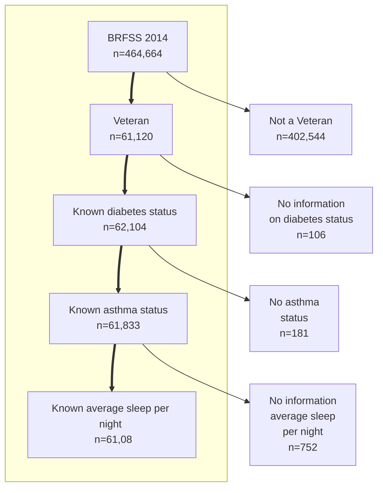
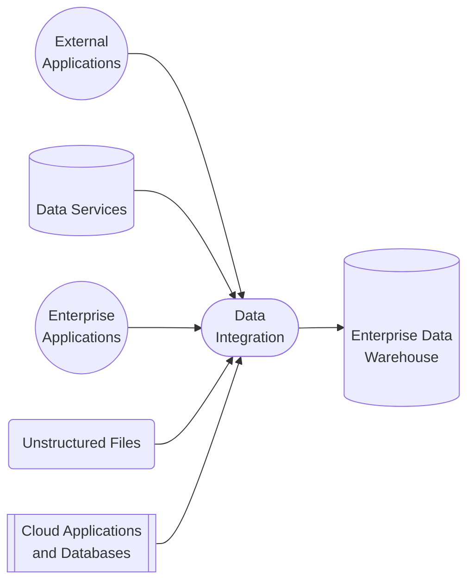

Using `mermaid` to create flowcharts.
See documentation at: https://mermaid-js.github.io/mermaid/#/flowchart

By using diagram tools like `mermaid`:
* modifications to flowcharts do not have to be re-uploaded with images every time.
* the markdown syntax is intuitive. 

However, `mermaid` sometimes cannot 100% recreate the desired graphs. Work-arounds may be necessary (see difference of the flowchart below and `data_process_flow.png`).

## Data processing flow diagram
A sample recreation of the data processing flow enclosed in this directory:

## Data integration diagram

